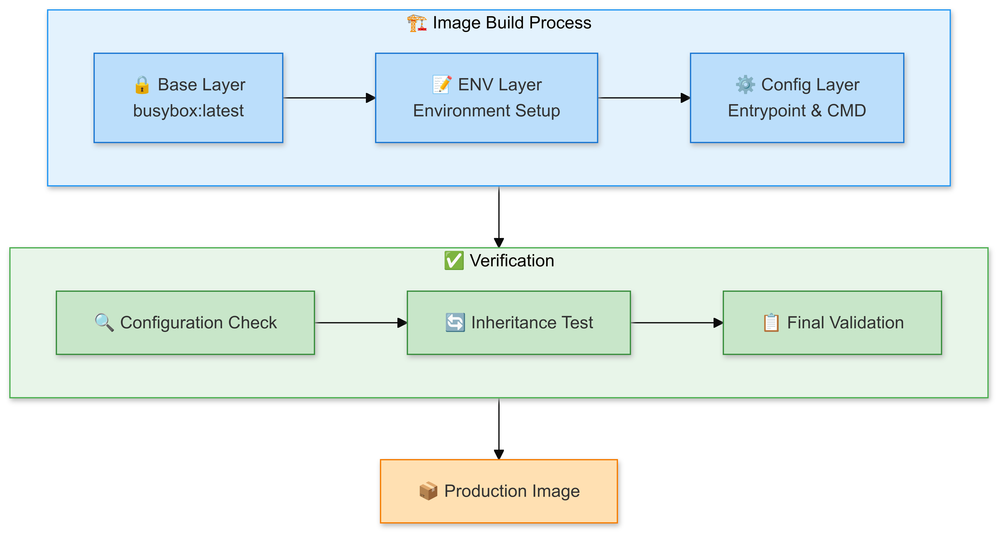

# 🐳 Docker Image Attribute Master: Advanced Container Configuration

[](https://github.com/TheToriqul/docker-image-attributes)


## 📋 Project Overview

This project demonstrates advanced Docker image attribute manipulation, focusing on the intricate relationships between container configurations and image layers. Through hands-on implementation, I've developed a comprehensive understanding of how Docker image attributes are modified, inherited, and maintained across different layers of an image.

## 🎯 Key Objectives

- Master the modification of Docker image attributes through practical implementation
- Demonstrate advanced container configuration techniques using environment variables
- Implement and verify entrypoint and command inheritance patterns
- Develop expertise in Docker layer management and attribute persistence
- Create reproducible container configurations for production environments

## 🏗️ Project Architecture

The project demonstrates a systematic approach to Docker image attribute manipulation through a two-phase process. First, we start with a busybox base image and progressively build layers by adding environment variables and configuring entrypoint/command settings, creating a well-structured image hierarchy. Then, we implement a comprehensive verification phase that includes configuration checks, inheritance testing, and final validation, ensuring all attributes are correctly maintained across layers. This methodical approach culminates in a production-ready image that maintains all specified configurations and demonstrates proper attribute inheritance patterns.

<figure >
  <p align="center">
      
      <p align="center">Project Architecture</p> 
  </p>
</figure>

## 💻 Technical Stack

- **Container Runtime**: Docker
- **Base Image**: busybox:latest
- **Shell**: Bash/Shell scripting
- **Operating System**: Linux
- **Version Control**: Git

## 🚀 Getting Started

<details>
<summary>🐳 Prerequisites</summary>

- Docker Engine installed (version 20.10 or higher)
- Basic understanding of Docker commands
- Linux/Unix environment
- Git for version control

</details>

<details>
<summary>⚙️ Installation</summary>

1. Clone the repository:
   ```bash
   git clone https://github.com/TheToriqul/docker-image-attributes.git
   ```
2. Navigate to the project directory:
   ```bash
   cd docker-image-attributes
   ```

</details>

<details>
<summary>🎮 Usage</summary>

Follow the steps in the [reference-commands.md](reference-commands.md) file for detailed implementation instructions. The project demonstrates:

1. Creating containers with custom environment variables
2. Committing containers with modified attributes
3. Verifying attribute inheritance across image layers
4. Managing entrypoint and command configurations

</details>

## 💡 Key Learnings

### Technical Mastery:

1. Advanced Docker image layer management
2. Container attribute inheritance patterns
3. Environment variable persistence across container commits
4. Docker entrypoint and command configuration
5. Container metadata management

### Professional Development:

1. Infrastructure as Code principles
2. Container configuration best practices
3. Debugging and verification techniques
4. Documentation and knowledge sharing
5. Systematic problem-solving approach

### 🔄 Future Enhancements

<details>
<summary>View Planned Improvements</summary>

1. Implement multi-stage builds for attribute inheritance
2. Add support for Docker Compose configurations
3. Create automated testing for attribute verification
4. Develop CI/CD pipeline integration
5. Add volume and network attribute management
6. Implement secure credential handling

</details>

## 🙌 Contribution

Contributions are welcome! Feel free to [open an issue](https://github.com/TheToriqul/docker-image-attributes/issues) or submit a [pull request](https://github.com/TheToriqul/docker-image-attributes/pulls) to suggest improvements or add features.

## 📧 Connect with Me

- 📧 Email: toriqul.int@gmail.com
- 📱 Phone: +65 8936 7705, +8801765 939006
- 🌐 LinkedIn: [@TheToriqul](https://www.linkedin.com/in/thetoriqul/)
- 🐙 GitHub: [@TheToriqul](https://github.com/TheToriqul)
- 🌍 Portfolio: [TheToriqul.com](https://thetoriqul.com)

Let's connect and discuss container technology and DevOps practices!

## 👏 Acknowledgments

- [Poridhi](https://devops.poridhi.io/) for providing comprehensive resources that inspired this project
- The Docker community for maintaining excellent documentation
- Fellow developers who provided valuable feedback and suggestions

---

Thank you for exploring this project! I hope you find it helpful in understanding Docker image attributes and container configuration management. Happy containerizing! 🚀